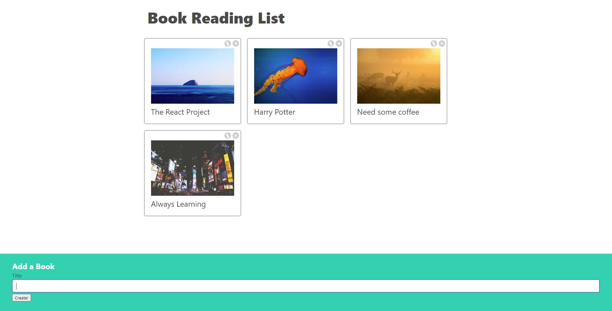

# React-Project-Create-Edit-Delete-Book-List

The finished project can be found here: https://dainty-truffle-0863c6.netlify.app

## Learning Objectives

- Introducing Event System and Handlers
- Working with the State System
- Rendering and Re-rendering?
- Overview of Http Requests 
- Understanding Child to Parent Communication
- Handling Forms and State Updates

## The Mission (First Part)

Make a book Application where a client can add a book, edit the titles of the books and delete the books entirely of the page.

## The Mission (Second Part)

In the second part we will make use of our own local Json Server setup and a file called db.json so we can actually keep track of the books and do not lose them on a refresh of the page. Therefor, we can now make use of the POST request to create a book, the PUT request to edit a book and at last the DELETE request to delete a book.

## Steps of creating this APP

- Create all components ((BookCreate, BookList, BookEdit and BookShow)
- Make a nice layout for the page
- Make a request to an external API to get some random pictures for the books.

## Solution

In this project I wanted to make a Book List where a customer can add books, edit titles of books and delete books. 
I used several components (BookCreate, BookList, BookEdit and BookShow) which you can find in my projects folder. 

##### Conclusion

I had a good learning curve on this project and it was fun to do. I hope to do more projects like this in the near future!
